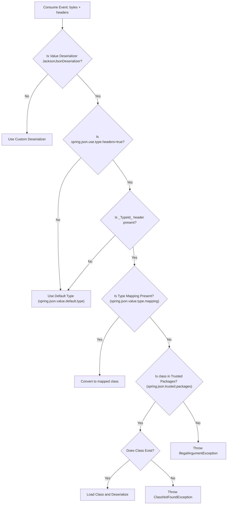

# Kafka Deep Dive

A Spring Boot application demonstrating Kafka producer and consumer configuration with advanced features like batching, compression, retries, and idempotency.

## Application Configuration

- **Server Port**: 8080
- **Application Name**: kafka-deep-dive
- **Kafka Bootstrap Servers**: localhost:9095,localhost:9096
- **Topic**: order-events-topic
- **Scheduled Producer**: Disabled (set `enable.scheduled.producer=true` to enable)

## Producer Configuration

### Basic Settings
- **Acknowledgment**: `acks=all` - Wait for all in-sync replicas to acknowledge
- **Key Serializer**: StringSerializer
- **Value Serializer**: JacksonJsonSerializer

### Record Accumulator (Batching)
Kafka batches multiple records together to improve throughput. The producer waits for either:
- **Batch Size**: 32KB (32768 bytes) - Maximum batch size
- **Linger Time**: 20ms - Maximum time to wait for more records before sending the batch

**Trade-off**: Larger batches = better throughput but higher latency. Smaller batches = lower latency but reduced throughput.

### Compression
- **Compression Type**: snappy
- Compresses batches to reduce network bandwidth and storage
- Snappy offers a good balance between compression ratio and CPU overhead
- Other options: gzip (higher compression, slower), lz4 (faster, lower compression), zstd (modern, efficient)

### Retries
- **Retries**: 3
- Number of times the producer will retry sending a failed record
- Retries help handle transient network failures

### Max In-Flight Requests
- **Max In-Flight Requests Per Connection**: 5
- Maximum number of unacknowledged requests the client can send on a single connection before blocking

### Issues with Retries + Max In-Flight Requests
When both retries and max-in-flight-requests > 1 are enabled:
1. **Duplicate Records**: Broker might write duplicate records into the partition
2. **Message Reordering**: Messages may arrive out of order due to retries

### Idempotency
- **Enabled**: `enable.idempotence=true`

**What it does:**
- Prevents duplicate messages on retry
- Preserves ordering even with in-flight requests > 1
- Assigns each message a Producer ID (PID) and sequence number
- Broker rejects out-of-order sequences, forcing correct ordering

**Automatic configurations when idempotence is enabled:**
- Forces `acks=all`
- Internally sets `retries=MAX_INT` (effectively infinite retries)

**Limitation:**
Even with idempotence enabled, there's a loophole where duplicate messages can occur if the producer restarts and attempts to resend messages that were in progress. This can be solved using **transactions**.

## Consumer Configuration

### Basic Settings
- **Group ID**: order-consumer-group
- **Key Deserializer**: StringDeserializer
- **Value Deserializer**: JacksonJsonDeserializer
- **Default Type**: com.hans.event.Order (for JSON deserialization)

### JSON Deserialization Flow and `_TypeId_` Header

When a producer uses `JsonSerializer`, it automatically adds a `_TypeId_` header for every record when published using spring KafkaTemplate with specific type instead of Object class unless explicitly disabled by setting `spring.kafka.producer.properties.spring.json.add.type.headers=false`.

At the consumer side, the Spring Kafka framework follows a specific flow to determine how to deserialize the incoming JSON payload based on the presence of the `_TypeId_` header and other configurations.

#### Deserialization Flow

#### Step-by-Step Explanation
1. **Event Consumption**: For each consumed event, the framework receives the payload (bytes) along with the headers.
2. **Deserializer Check**: It first checks if the configured value deserializer is `JacksonJsonDeserializer`.
   - If not, it falls back to the custom deserializer.
3. **Use Type Headers Config**: If using `JacksonJsonDeserializer`, it checks the `spring.kafka.consumer.properties.spring.json.use.type.headers` configuration (which is `true` by default).
   - If `false`, it directly uses the default type specified in `spring.kafka.consumer.properties.spring.json.value.default.type`.
4. **`_TypeId_` Header Presence**: If `true`, it checks for the presence of the `_TypeId_` header.
   - If missing, it uses the configured default type.
5. **Type Mapping**: If the `_TypeId_` header exists, it checks if there is a type mapping configured via `spring.kafka.consumer.properties.spring.json.value.type.mapping` (e.g., `com.from.Event:com.to.Event`).
   - If a mapping is present, it uses the mapped class for deserialization.
6. **Trusted Packages**: If no mapping is present, it verifies if the class name provided in the `_TypeId_` header is within the configured trusted packages (`spring.kafka.consumer.properties.spring.json.trusted.packages` or implicitly trusted).
   - If not trusted, it throws an `IllegalArgumentException`.
7. **Class Loading**: If it is a trusted package, it attempts to load the class.
   - If the class exists, it successfully loads the class and deserializes the payload.
   - If the class does not exist in the consumer's classpath, it throws a `ClassNotFoundException`.
## Project Structure
- `Order.java` - Event model
- `OrderCreatedEventProducer.java` - Kafka producer for order events
- `OrderConsumer.java` - Kafka consumer for order events
- `EventScheduler.java` - Scheduled event producer (when enabled)
- `AppConfig.java` - Application configuration

## Running the Application
1. Ensure Kafka is running on localhost:9095 and localhost:9096
2. Run the Spring Boot application
3. To enable the scheduled producer, set `enable.scheduled.producer=true` in application.properties
