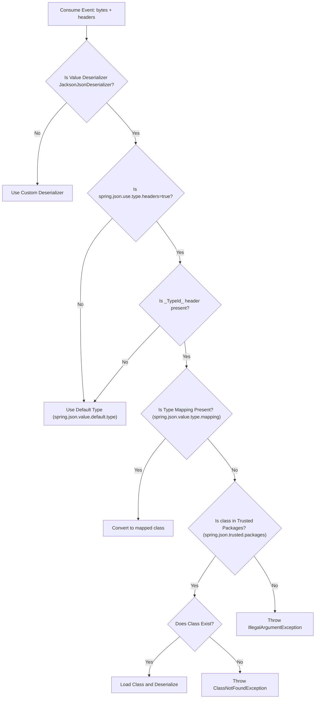

# Kafka Deep Dive

A multi-module Maven project demonstrating Kafka producer and consumer configurations with advanced features like batching, compression, retries, and idempotency, split into separate standalone applications that can run concurrently.

## Aggregator Architecture & Project Layout

The codebase has been split into two independent Spring Boot services under a parent aggregator POM:
1. **`kafka-producer`** (Runs on Port `8080`): Exposes REST Controller endpoints for on-demand message publishing and includes an optional scheduled event generator.
2. **`kafka-consumer`** (Runs on Port `8081`): Consumes events from the topics with configurable acknowledgement and fetch parameters.

### Global Configuration
- **Kafka Bootstrap Servers**: `localhost:9095,localhost:9096`
- **Topic**: `order-events-topic`

## Producer Configuration

### Basic Settings
- **Acknowledgment**: `acks=all` - Wait for all in-sync replicas to acknowledge
- **Key Serializer**: StringSerializer
- **Value Serializer**: JacksonJsonSerializer

### Record Accumulator (Batching)
Kafka batches multiple records together to improve throughput. The producer waits for either:
- **Batch Size**: 32KB (32768 bytes) - Maximum batch size
- **Linger Time**: 20ms - Maximum time to wait for more records before sending the batch

**Trade-off**: Larger batches = better throughput but higher latency. Smaller batches = lower latency but reduced throughput.

### Compression
- **Compression Type**: snappy
- Compresses batches to reduce network bandwidth and storage
- Snappy offers a good balance between compression ratio and CPU overhead
- Other options: gzip (higher compression, slower), lz4 (faster, lower compression), zstd (modern, efficient)

### Retries
- **Retries**: 3
- Number of times the producer will retry sending a failed record
- Retries help handle transient network failures

### Max In-Flight Requests
- **Max In-Flight Requests Per Connection**: 5
- Maximum number of unacknowledged requests the client can send on a single connection before blocking

### Issues with Retries + Max In-Flight Requests
When both retries and max-in-flight-requests > 1 are enabled:
1. **Duplicate Records**: Broker might write duplicate records into the partition
2. **Message Reordering**: Messages may arrive out of order due to retries

### Idempotency
- **Enabled**: `enable.idempotence=true`

**What it does:**
- Prevents duplicate messages on retry
- Preserves ordering even with in-flight requests > 1
- Assigns each message a Producer ID (PID) and sequence number
- Broker rejects out-of-order sequences, forcing correct ordering

**Automatic configurations when idempotence is enabled:**
- Forces `acks=all`
- Internally sets `retries=MAX_INT` (effectively infinite retries)

**Limitation:**
Even with idempotence enabled, there's a loophole where duplicate messages can occur if the producer restarts and attempts to resend messages that were in progress. This can be solved using **transactions**.

## Consumer Configuration

### Basic Settings
- **Group ID**: order-consumer-group
- **Key Deserializer**: StringDeserializer
- **Value Deserializer**: JacksonJsonDeserializer
- **Default Type**: com.hans.event.Order (for JSON deserialization)

### JSON Deserialization Flow and `_TypeId_` Header

When a producer uses `JsonSerializer`, it automatically adds a `_TypeId_` header for every record when published using spring KafkaTemplate with specific type instead of Object class unless explicitly disabled by setting `spring.kafka.producer.properties.spring.json.add.type.headers=false`.

At the consumer side, the Spring Kafka framework follows a specific flow to determine how to deserialize the incoming JSON payload based on the presence of the `_TypeId_` header and other configurations.

#### Deserialization Flow



#### Step-by-Step Explanation
1. **Event Consumption**: For each consumed event, the framework receives the payload (bytes) along with the headers.
2. **Deserializer Check**: It first checks if the configured value deserializer is `JacksonJsonDeserializer`.
   - If not, it falls back to the custom deserializer.
3. **Use Type Headers Config**: If using `JacksonJsonDeserializer`, it checks the `spring.kafka.consumer.properties.spring.json.use.type.headers` configuration (which is `true` by default).
   - If `false`, it directly uses the default type specified in `spring.kafka.consumer.properties.spring.json.value.default.type`.
4. **`_TypeId_` Header Presence**: If `true`, it checks for the presence of the `_TypeId_` header.
   - If missing, it uses the configured default type.
5. **Type Mapping**: If the `_TypeId_` header exists, it checks if there is a type mapping configured via `spring.kafka.consumer.properties.spring.json.value.type.mapping` (e.g., `com.from.Event:com.to.Event`).
   - If a mapping is present, it uses the mapped class for deserialization.
6. **Trusted Packages**: If no mapping is present, it verifies if the class name provided in the `_TypeId_` header is within the configured trusted packages (`spring.kafka.consumer.properties.spring.json.trusted.packages` or implicitly trusted).
   - If not trusted, it throws an `IllegalArgumentException`.
7. **Class Loading**: If it is a trusted package, it attempts to load the class.
   - If the class exists, it successfully loads the class and deserializes the payload.
   - If the class does not exist in the consumer's classpath, it throws a `ClassNotFoundException`.
## Advanced Consumer Configurations

This section covers the advanced settings configured in `application.properties` that govern fetch behavior, poll behavior, heartbeat/rebalance timing, and offset commit strategies.

### 1. Fetch & Poll Tuning
These configurations control how the consumer requests and retrieves data from the Kafka brokers to optimize throughput, latency, and memory usage.

*   **Metadata Max Age (`metadata.max.age.ms`)**:
    *   **Config**: `spring.kafka.consumer.properties.metadata.max.age.ms=5`
    *   **Purpose**: The maximum time (in milliseconds) to force a refresh of metadata even if we haven't seen any partition leadership changes. Set to `5` milliseconds in this project (default is 5 minutes / `300000` ms) for aggressive metadata refreshing.
*   **Poll Timeout (`poll-timeout`)**:
    *   **Config**: `spring.kafka.listener.poll-timeout=5000`
    *   **Purpose**: The maximum time (in milliseconds) the consumer thread blocks waiting for records during a single `poll()` call before returning. Set to `5000` ms (5 seconds).
*   **Partition Fetch Bytes (`max.partition.fetch.bytes`)**:
    *   **Config**: `spring.kafka.consumer.properties.max.partition.fetch.bytes=1048576`
    *   **Purpose**: The maximum amount of data (in bytes) the broker will return *per partition* in a single fetch request. Set to `1048576` bytes (1MB).
*   **Fetch Max Bytes (`fetch.max.bytes`)**:
    *   **Config**: `spring.kafka.consumer.properties.fetch.max.bytes=52428800`
    *   **Purpose**: The maximum total amount of data (in bytes) the broker should return for a single fetch request across all partitions. Set to `52428800` bytes (52MB).
*   **Fetch Min Bytes (`fetch.min.bytes`)**:
    *   **Config**: `spring.kafka.consumer.properties.fetch.min.bytes=1`
    *   **Purpose**: The minimum amount of data (in bytes) the broker must have accumulated before responding to a fetch request. Set to `1` byte (broker responds immediately when at least 1 byte is available).
*   **Fetch Max Wait Time (`fetch.max.wait.ms`)**:
    *   **Config**: `spring.kafka.consumer.properties.fetch.max.wait.ms=500`
    *   **Purpose**: The maximum time (in milliseconds) the broker will block/wait before responding to a fetch request if the data accumulated is less than `fetch.min.bytes`. Set to `500` ms (0.5 seconds).
*   **Max Poll Records (`max.poll.records`)**:
    *   **Config**: `spring.kafka.consumer.properties.max.poll.records=100`
    *   **Purpose**: The maximum number of records returned in a single `poll()` call.
    *   **Note**: If a broker sends more records (e.g., 2000 records to satisfy `fetch.max.bytes`), Spring Kafka keeps the extra records (e.g., 1900) in an internal buffer and supplies them in subsequent polls without making additional network requests to the broker.
*   **Idle Between Polls (`idle-between-polls`)**:
    *   **Config**: `spring.kafka.listener.idle-between-polls=5`
    *   **Purpose**: The gap or sleep duration (in milliseconds) between successive poll operations to allow some pause between polls. Set to `5` ms.

---

### 2. Consumer Liveness & Rebalance Settings
These properties help the Kafka Group Coordinator determine if a consumer is healthy, dead, or stuck, triggering a consumer group rebalance if necessary.

*   **Heartbeat Interval (`heartbeat.interval.ms`)**:
    *   **Config**: `spring.kafka.consumer.properties.heartbeat.interval.ms=3000`
    *   **Purpose**: The interval at which the consumer sends background heartbeat pulses to the Group Coordinator to indicate it is alive. Must be lower than `session.timeout.ms` (typically 1/3 of the value). Set to `3000` ms (3 seconds).
*   **Session Timeout (`session.timeout.ms`)**:
    *   **Config**: `spring.kafka.consumer.properties.session.timeout.ms=45000`
    *   **Purpose**: The maximum time the Group Coordinator waits without receiving a heartbeat before declaring the consumer dead and initiating a **rebalance** to reassign its partitions. Set to `45000` ms (45 seconds).
*   **Max Poll Interval (`max.poll.interval.ms`)**:
    *   **Config**: `spring.kafka.consumer.properties.max.poll.interval.ms=300000`
    *   **Purpose**: The maximum allowed delay between consecutive calls to `poll()`. If the consumer takes too long to process records and doesn't call `poll()` within this limit, the coordinator assumes the consumer has hung/stuck, leaves the group, and triggers a rebalance. Set to `300000` ms (5 minutes).

---

### 3. Offset Commit & Ack Modes (Offset Commit Modes)

In Apache Kafka, an **offset** is a unique identifier for a record within a partition. "Committing" an offset tells the Kafka broker, *"I have successfully processed all messages up to this point."* Choosing the right commit strategy is crucial for balancing **throughput** (performance) and **reliability** (preventing data loss or duplicate processing).

Here is a breakdown of the offset commit modes in Spring Kafka, including auto-commit and manual commit approaches.

#### Auto Commit

*   **Config**: `spring.kafka.consumer.properties.enable.auto.commit=true` (or `spring.kafka.consumer.enable-auto-commit=true`)
*   **Interval Config**: `spring.kafka.consumer.properties.auto.commit.interval.ms=1000` (1 second)
*   **How it works**: A background thread periodically checks if the specified interval has passed. If it has, it automatically commits the offsets for the fetched events, regardless of whether your application has actually finished processing them.
*   **Pros**: Easiest to set up; zero code required. High throughput since committing happens asynchronously without blocking your application.
*   **Cons**: High risk of data anomalies. If your application crashes *after* an auto-commit but *before* processing finishes, you lose data. If it crashes *before* the auto-commit but *after* processing, you will re-process duplicates upon restart.
*   **When to use**: Non-critical data streams (e.g., logging, basic metrics) where occasional data loss or duplication is acceptable.

#### Manual Commit (Ack Modes)

To utilize manual commit modes and gain strict control over message processing guarantees, you must first disable auto-commit:
```properties
spring.kafka.consumer.properties.enable.auto.commit=false
```

You then control the exact commit behavior by configuring the acknowledgment mode:
```properties
spring.kafka.listener.ack-mode=[MODE]
```

##### `BATCH` (Default)
*   **How it works:** When the consumer polls and retrieves a batch of records (e.g., 500 records), it processes all of them sequentially. Once the *entire batch* is completely processed without errors, the framework sends a single commit request for the highest offset.
*   **Pros:** Excellent balance of high throughput (only one network call per batch) and safety.
*   **Cons:** If record 499 out of 500 throws an exception, none of the batch offsets are committed. Upon restart, the consumer will re-process all 500 records (duplicate processing).
*   **When to use:** The recommended default for most general use cases where occasional duplicate processing upon failure is acceptable.

##### `RECORD`
*   **How it works:** A commit request is sent immediately over the network to the broker after *each individual record* is processed successfully.
*   **Pros:** Minimizes duplicate processing. If the application crashes, only the currently processing record will be redelivered.
*   **Cons:** Massive network overhead. Committing 500 times for 500 records drastically reduces your application's throughput.
*   **When to use:** Strict processing requirements where processing time is already slow (e.g., heavy database writes) and minimizing duplicate processing is worth the severe network performance cost.

##### `TIME`
*   **Properties:** `ack-mode=time`, `spring.kafka.listener.ack-time=5000`
*   **How it works:** Commits offsets based on a time interval. The framework will commit whatever has been successfully processed every few seconds (as defined by your limit).
*   **When to use:** When you want batch-like behavior but want to guarantee that offsets are committed at a predictable cadence, even if message volume is low and batches take a long time to fill up.

##### `COUNT`
*   **Properties:** `ack-mode=count`, `spring.kafka.listener.ack-count=10`
*   **How it works:** Commits the offsets only after a strictly defined number of records (e.g., after every 10 records) have been successfully processed, regardless of batch boundaries.
*   **When to use:** When you are processing very large batches and want to create frequent "checkpoints" to avoid massive replays in case of a failure midway through a batch.

##### `MANUAL`
*   **How it works:** You manage this programmatically by injecting an `Acknowledgment` object into your `@KafkaListener` method parameter and invoking `ack.acknowledge()` when your business logic completes. However, **it essentially behaves like `BATCH`**—even if you acknowledge each record, the framework queues those acknowledgments and waits for the entire polled batch to complete before sending a single commit command to Kafka.
*   **Pros:** Allows conditional processing. You can choose *not* to acknowledge a message if it doesn't meet certain criteria, allowing you to skip commits conditionally.
*   **When to use:** When your business logic requires programmatic control over *if* a message was successfully handled, rather than relying on the listener method simply returning without an exception.

##### `MANUAL_IMMEDIATE`
*   **How it works:** Uses the same code setup as `MANUAL` (invoking `ack.acknowledge()`), but differs significantly in execution. It initiates the network commit *immediately* for each record as soon as the method is invoked, instead of waiting for the rest of the batch to finish.
*   **Pros:** Immediate, exact control over the commit timing within your code execution flow.
*   **Cons:** Introduces the same heavy network overhead issues as the `RECORD` mode.
*   **When to use:** Highly sensitive transactions where you need absolute certainty that a specific message is committed *right now*, before the next line of code executes.

## Transaction in Kafka

1. Producer transaction id should be unique per instance, if the producer applciaiton is running on multiple instances at the same time.
1. Why we need to have unique id for each instance of producer is to avoid `ZOMBIE FENCING`
1. We need to set unique prefix for transaction id for every applciaiton `spring.kafka.producer.transaction-id-prefix=myapp-`

---

## Project Structure

```text
.
├── pom.xml                        # Parent aggregator POM
├── kafka-producer                 # Producer module
│   ├── pom.xml                    # Producer build configuration (with web starter)
│   └── src/main/java/com/hans
│       ├── App.java               # Launcher for producer
│       ├── config/AppConfig.java  # Producer templates config
│       ├── controller/            # REST API publishing controller (POST endpoints)
│       ├── event/                 # Producer events schema (OrderCreatedEvent, PaymentEvent, NotifyEvent)
│       └── producer/              # Serialization and sending services (Scheduler, etc.)
└── kafka-consumer                 # Consumer module
    ├── pom.xml                    # Consumer build configuration
    └── src/main/java/com/hans
        ├── App.java               # Launcher for consumer
        ├── config/AppConfig.java  # Consumer & listener container factories config
        ├── event/                 # Consumer events schema (Order, PaymentEvent, NotifyEvent)
        └── consumer/              # Listener record processing classes (OrderConsumer, OtherEventConsumer)
```

---

## Running the Application

### 1. Prerequisite
Ensure Kafka brokers are running on `localhost:9095` and `localhost:9096`.

### 2. Building the Project
From the root directory, compile and build both submodules:
```bash
mvn clean package
```

### 3. Running the Producer Service (Port 8080)
To run the producer:
```bash
cd kafka-producer
mvn spring-boot:run
```
*To enable the scheduled event generator, set `enable.scheduled.producer=true` in `kafka-producer/src/main/resources/application.properties`.*

### 4. Running the Consumer Service (Port 8081)
To run the consumer:
```bash
cd kafka-consumer
mvn spring-boot:run
```

---

## Publishing Events via REST API (Producer)

When the `kafka-producer` is running, you can publish events to Kafka on-demand by sending HTTP `POST` requests:

#### 1. Publish Order Event (`order-events-topic`)
```bash
curl -X POST http://localhost:8080/api/publish/order \
  -H "Content-Type: application/json" \
  -d '{"id":123,"orderNumber":"ORD-12345","customerId":"CUST-88","productId":"PROD-99","quantity":3,"price":499.50}'
```

#### 2. Publish Payment Event (`payment-events`)
```bash
curl -X POST http://localhost:8080/api/publish/payment \
  -H "Content-Type: application/json" \
  -d '{"paymentId":"PAY-777","orderId":"ORD-12345","amount":499.50,"status":"SUCCESS","currency":"USD"}'
```

#### 3. Publish Notification Event (`notify-events`)
```bash
curl -X POST http://localhost:8080/api/publish/notify \
  -H "Content-Type: application/json" \
  -d '{"notifyId":"NOT-999","customerId":"CUST-88","message":"Order ORD-12345 processed successfully","type":"EMAIL","priority":"HIGH"}'
```
